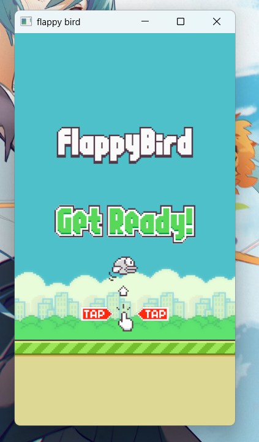

# flappy-bird

一个简单的flappy-bird小游戏，基于bevy 0.15版本制作

感觉这个游戏挺适合拿来练手的，有兴趣的可以尝试尝试，素材在assets文件夹中

学习bevy一段时候之后，挺想找个小项目练手，一开始参考一位老哥博客做了个贪吃蛇，感觉不是很过瘾。最近正好看到了另一位老哥基于bevy 0.10制作flappy-bird，感觉很有意思，就想基于最新版本bevy再做一遍看看，感谢老哥提供的素材！顺便，这个项目我没有参考老哥的代码实现，完全是自己凭感觉瞎整的，所以代码估计比较烂哈哈。对于一些具体的代码规范建议参考参考老哥的实现方式，毕竟人家是bevy项目组的大佬

[老哥的项目地址](https://github.com/LiamGallagher737/bevy_flappy_bird.git)

